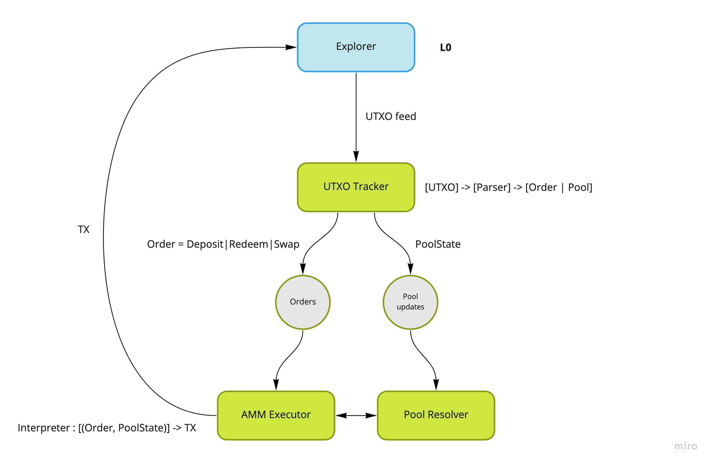

# ErgoDEX off-chain services

A set of off-chain services facilitating ErgoDEX functioning.

AMM DEX services:
 - UTXO Tracker - extracts AMM orders and pool state updates from the UTXO feed
 - AMM Executor - executes AMM orders into a transaction chain
 - Pool Resolver - tracks pool updates

OrderBook DEX services:
 - UTXO Tracker - extracts orders from the UTXO feed
 - Matcher - order-book matching engine
 - Orders Executor - executes orders
 - Markets API - aggregates market data and provides a convenient API to access it
